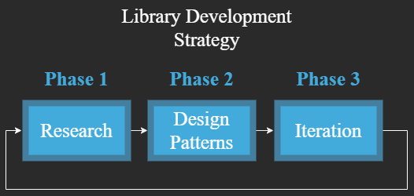

# Project Title: MicroRPG Library

Veracode October 2022 Hackathon project

## Description

This hack aims to simplify the complexity of codifying your favorite RPG by producing an extensible library to accelerate development time creating your own web-driven RPG. Scope of this project is to implement reusable components of rudimentary DnD 5e mechanics.

## Specification

- Library built with Typescript
- Demo Application Hosted Over NodeJS locally
- Client/Server communication driven with Rest API

## Hackathon Scheduled Developement
- October 19, 2022
  - Create GitHub Project template
  - Upload Potential Design Models
  - Research important RPG Mechanics
  - Document toolings to produce/assist with POC
- October 20, 2022
  - Finalize Design Model
  - Implement Design Model of Library
  - Start implementing a sample demo app using the library
- October 21, 2022
  - Finalize POC
  - Document results

## Design & Strategy

After identifying critical components of DnD 5e, assess potential use-cases for each component and identify any useful design patterns that can be codified for each component.

### RPG Components

- Character
  - statistics
  - inventory
  - description
  - ability
  - updateCharacter
- Actions
  - spellcasting
  - attack
  - move
  - activateAbility
  - useItem
- Location
  - coordinate
  - effect
- Combat
  - turn-based
    - turn-order
  - real-time (out-of-scope)

## Links
[Tooling Documentation](Tooling.md)

## Research References

[TheGamer.com Game Changing RPG Mechanics](https://www.thegamer.com/rpg-mechanics-game-changer-outdated/)

[Mythcreants.com Fantastic Roleplaying Mechanics](https://mythcreants.com/blog/six-fantastic-roleplaying-mechanics/)

[Reddit r/rpg Comparative Analysis of Different RPG Systems](https://www.reddit.com/r/rpg/comments/wfq06/comparative_analysis_of_different_rpg_systems/?utm_source=share&utm_medium=web2x&context=3)

[Dungeons and Dragons Player's Handbook 5th Edition](https://dnd.wizards.com/products/rpg_playershandbook)

